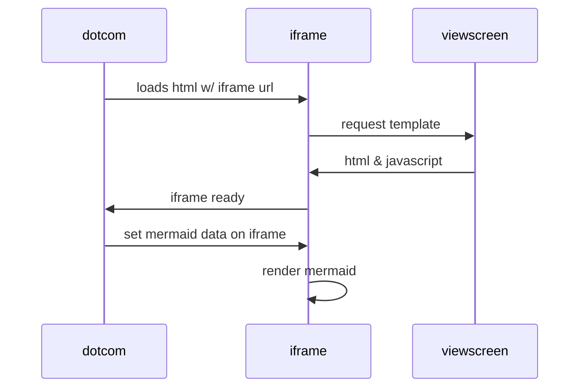
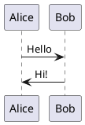

# Complex Markdown

<details>
  <summary>Collapsible 🎭</summary>
  
  → Easy  
  → And simple
</details>

## Math

Inline math equations go in like so: $\omega = d\phi / dt$. Display
math should get its own line and be put in in double-dollarsigns:

$$I = \int \rho R^{2} dV$$

And note that you can backslash-escape any punctuation characters
which you wish to be displayed literally, ex.: \`foo\`, \*bar\*, etc.

## Mermaid




## PlantUML



## Geo JSON

```geojson
{
  "type": "FeatureCollection",
  "features": [
    {
      "type": "Feature",
      "id": 1,
      "properties": {
        "ID": 0
      },
      "geometry": {
        "type": "Polygon",
        "coordinates": [
          [
            [
              -90,
              35
            ],
            [
              -90,
              30
            ],
            [
              -85,
              30
            ],
            [
              -85,
              35
            ],
            [
              -90,
              35
            ]
          ]
        ]
      }
    }
  ]
}
```

## STL

```stl
solid cube_corner
  facet normal 0.0 -1.0 0.0
    outer loop
      vertex 0.0 0.0 0.0
      vertex 1.0 0.0 0.0
      vertex 0.0 0.0 1.0
    endloop
  endfacet
  facet normal 0.0 0.0 -1.0
    outer loop
      vertex 0.0 0.0 0.0
      vertex 0.0 1.0 0.0
      vertex 1.0 0.0 0.0
    endloop
  endfacet
  facet normal -1.0 0.0 0.0
    outer loop
      vertex 0.0 0.0 0.0
      vertex 0.0 0.0 1.0
      vertex 0.0 1.0 0.0
    endloop
  endfacet
  facet normal 0.577 0.577 0.577
    outer loop
      vertex 1.0 0.0 0.0
      vertex 0.0 1.0 0.0
      vertex 0.0 0.0 1.0
    endloop
  endfacet
endsolid
```
